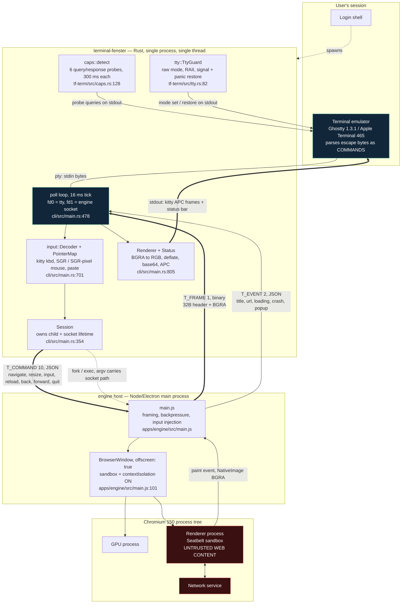
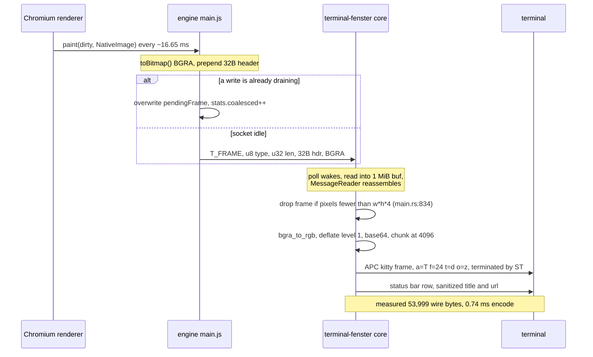

# B01 — Terminal-Fenster Architecture RFC

**Status:** Draft for commander review
**Date:** 2026-07-31
**Scope:** process graph, trust boundaries, control/data plane split, package boundaries, failure modes, ADR register
**Method:** every structural claim below is read out of the tree at the cited `file:line`. Numbers are either re-measured in this session or carried from a named sibling artifact with its evidence class. Anything I could not confirm is marked **UNVERIFIED** and is not built on.

This RFC describes **what exists**, not what is planned. Where the built system diverges from a sibling artifact's recommendation, the divergence is called out as a gap rather than papered over.

---

## 0. Source snapshot and re-measured ground truth

**The core source changed while this RFC was being written.** Between my first read and my last verification pass, `apps/cli/src/main.rs` grew 932 → 1,039 lines, `crates/tf-term/src/caps.rs` grew 319 → 373, and `apps/engine/src/main.js` grew 290 → 309. All line citations below are therefore anchored to an explicit snapshot; if the sizes no longer match, re-verify before acting on a citation.

| File | Lines | mtime |
|---|---|---|
| `apps/cli/src/main.rs` | 1,039 | 31 Jul 21:49:04 |
| `apps/engine/src/main.js` | 309 | 31 Jul 21:46:55 |
| `crates/tf-term/src/caps.rs` | 373 | 31 Jul 21:44:13 |
| `crates/tf-proto/src/lib.rs` | 284 | 31 Jul 21:23:03 |
| `crates/tf-term/src/unicode.rs` | 164 | 31 Jul 21:20:15 |
| `crates/tf-term/src/input.rs` | 768 | 31 Jul 21:18:45 |
| `crates/tf-term/src/kitty.rs` | 396 | 31 Jul 21:17:06 |
| `crates/tf-term/src/tty.rs` | 256 | 31 Jul 21:15:51 |
| `crates/tf-term/src/b64.rs` | 89 | 31 Jul 21:14:56 |
| `crates/tf-term/src/lib.rs` | 124 | 31 Jul 21:14:42 |

| Fact | Value | How obtained (this session) |
|---|---|---|
| Workspace tests | **96 passing, 0 failing** — tf-proto 12, tf-term 70, terminal-fenster 14 | `cargo test --workspace`, final pass |
| Test count drift during this RFC | 91 → 96 | two runs, ~40 minutes apart |
| Rust source size | 3,802 lines across 9 files | `wc -l` |
| Workspace members | `crates/tf-term`, `crates/tf-proto`, `apps/cli` | `Cargo.toml:3` |
| Crate coupling | tf-term and tf-proto **do not reference each other** | `crates/*/Cargo.toml` — neither declares the other |
| tf-proto dependencies | **none at all** | `crates/tf-proto/Cargo.toml` has no `[dependencies]` |
| Integration tests | **none** — `tests/` is an empty directory | `ls -la tests/` |
| Git history | **no commits on `main`** | `git log` → `does not have any commits yet` |
| LICENSE file | **absent**, though `Cargo.toml:9` declares `MIT OR Apache-2.0` | `ls LICENSE*` → no match |

The mission brief states 87 unit tests; the tree yielded 91 at first read and 96 at last. The direction is upward, so this is a stale brief rather than a regression.

Carried forward, not re-measured:

- Engine cadence: 60 fps, frame gap p50 **16.65 ms**, p99 **19.94 ms** (`docs/adr/ADR-0001-browser-engine.md`).
- End-to-end in Ghostty 1.3.1: engine ready **212 ms**, first frame **366 ms**, an 8,081,424-byte BGRA frame (2482×814) encoded to **53,999 wire bytes in 0.74 ms** (~150× reduction).
- PTY write is the true bottleneck, not Chromium: a full-resolution base64 RGBA frame costs **10.854 ms p50 / 20.080 ms p99** to `write()` at 1 KiB chunks; a 40,000-byte delta costs **0.138 ms p50** (A10 §0.1, `benchmarks/probes/pty3.c`).
- Damage tracking saves **0.2%** on scroll but 81–99% on typing; kitty `a=p` source-rectangle re-placement makes a scroll frame cost **55 bytes** instead of 387,568 (A07 §0).

The 0.74 ms encode and the 53,999-byte payload together are why the built path is viable at all: compression moves the terminal write from A10's 10.8 ms row toward its 0.138 ms row. **Compression is load-bearing, not an optimization.**

---

## 1. The process graph as built



Transport between core and engine is a **Unix domain socket** created by the core as listener, in a private `0700` directory under `$TMPDIR`, with the socket file chmod'd `0600` (`apps/cli/src/main.rs:392-400`). No network listener is ever opened, in either process. The engine learns the path from `--bg-socket=` on its argv (`apps/engine/src/main.js:20`).

Process ownership is strictly hierarchical: the shell owns `terminal-fenster`; `terminal-fenster` owns the Electron main process (`Command::spawn`, `apps/cli/src/main.rs:404-411`); Electron owns the Chromium tree. Both directions of orphan prevention are wired — the core kills the child on teardown after a 1500 ms grace (`apps/cli/src/main.rs:657-676`), and the engine exits when the socket closes (`apps/engine/src/main.js:307`).

### 1.1 Frame lifecycle



The engine keeps **at most one frame in flight** and coalesces newer frames over older ones while a write drains (`apps/engine/src/main.js:48-99`). Newest-wins is the correct policy for interactivity and it is the only thing standing between a slow terminal and unbounded memory growth. The core has no matching queue: it renders whatever it last decoded, gated by a `dirty` flag.

---

## 2. Trust boundaries

A09 established the boundary IDs; this section states where each one is *enforced in code today*, which is the part an RFC has to be accountable for.

| ID | Boundary | Enforced at | Status in tree |
|---|---|---|---|
| **TB1** | Web content → Chromium renderer process | Chromium multi-process + macOS Seatbelt | **Enforced.** `sandbox: true` at `apps/engine/src/main.js:111`. ADR-0001 records that only the *harness* sandbox was relaxed for spikes, never Chromium's. |
| **TB2** | Renderer → Electron main process | Mojo IPC + `contextIsolation: true`, `nodeIntegration: false`, `webSecurity: true` | **Enforced** at `apps/engine/src/main.js:106-113`. No preload script exists, so there is currently no `contextBridge` surface at all — the strongest possible position, and one to defend. |
| **TB3** | Core → user's TTY byte stream | Our own sanitizer | **Partially enforced.** Page-derived text is sanitized before the status bar (`apps/cli/src/main.rs:887-888` calling `unicode::sanitize_for_terminal`, which strips C0, DEL, C1 and U+2028/9 — `crates/tf-term/src/unicode.rs:57-75`). But A09 §1.3 demands a *single writer*, and there are **three** independent writers to the tty today. See §2.1. |
| **TB4** | Any local process → Terminal-Fenster control plane | Filesystem permissions | **Enforced by mode, not by identity.** `0700` dir + `0600` socket (`apps/cli/src/main.rs:392-400`). There is no peer audit-token check and no capability token; a same-uid process that can read the directory can connect and drive the browser. Adequate for v0, insufficient for A09's TB4 as specified. |
| **TB5** | Web content → agent reasoning context | Architectural | **Not applicable yet** — no agent surface is built. |
| **TB6** | Build inputs → shipped binary | Lockfiles, pinning, notarization | **Not started.** `Cargo.lock` exists; `apps/engine/package.json` pins `electron: ^43.2.0` with a caret, so a fresh install can float to any 43.x. No LICENSE file, no fuses, no notarization. |

### 2.1 The TB3 writer problem, precisely

A09 §1.3 states the rule as "any write to the tty outside the single writer module is a build failure." Today the tty is written from three places:

1. `crates/tf-term/src/tty.rs:169-171` — `enable_input_protocols` writes mode-setting sequences to `io::stdout()`.
2. `crates/tf-term/src/caps.rs:116-120` — `query()` writes each probe sequence to `io::stdout()`; `detect` also writes an image-cleanup sequence directly at `:150-153`.
3. `apps/cli/src/main.rs:899-901` — `Renderer::present` writes frames and the status bar to `io::stdout()`.

Plus a fourth, deliberately outside Rust's stdio: `crates/tf-term/src/tty.rs:56-60` uses raw `libc::write` in the signal path, which is correct and must stay that way — `println!` is not async-signal-safe.

None of the three is currently unsafe: (1) and (2) emit only constant byte strings, and (3) sanitizes the only attacker-controlled strings it handles. The risk is not present-tense, it is structural. The moment someone adds a link-hover preview, a download filename, a JS `alert()` body, or a TLS subject CN to the status bar — all of which A09 §1.1 enumerates as attacker-controlled — the sanitizer becomes something a developer must *remember*, and TB3 is exactly the boundary where forgetting once is a clipboard-poisoning-to-shell-execution chain.

**The fix is cheap now and expensive later:** make the tty a resource that only one type can write to, and make `sanitize_for_terminal` unskippable by construction (a `TerminalText` newtype that only the sanitizer can mint). This is the single recommendation of this RFC; see §7.

### 2.2 Trust asymmetry in the wire protocol

The core trusts the engine's length prefix without bound. `MessageReader::next_message` (`crates/tf-proto/src/lib.rs:81-93`) reads a `u32` length and waits for that many bytes, so a corrupt or hostile prefix asks the core to buffer up to 4 GiB. The frame payload is separately validated — a frame with fewer pixels than `w*h*4` is dropped rather than rendered (`apps/cli/src/main.rs:834-836`, with a regression test) — but that check happens *after* the allocation.

Today the engine is our own process on the far side of a `0600` socket, so this is a robustness issue rather than a live vulnerability. It becomes a real trust boundary the moment A07's topology (b′) lands and the far side of that socket is a remote host over `ssh -T`. **A length cap belongs in `tf-proto` before, not after, remote transport ships.**

---

## 3. Control plane vs data plane

They share one socket and one poll loop but nothing else. The split is by encoding, direction, rate, and failure semantics.

| | Control plane | Data plane |
|---|---|---|
| Message types | `T_COMMAND` = 10 (core→engine), `T_EVENT` = 2 (engine→core) | `T_FRAME` = 1 (engine→core) |
| Encoding | JSON, flat objects | 32-byte big-endian binary header + raw BGRA |
| Parser | Hand-rolled field extractors, `json_get_str` / `json_get_bool` (`crates/tf-proto/src/lib.rs:125,158`) | `FrameHeader::parse`, fixed offsets (`crates/tf-proto/src/lib.rs:33`) |
| Rate | Human-scale — keystrokes, clicks, navigations | 60 Hz, ~8 MB per message at full resolution |
| Loss policy | **Must not be lost.** No coalescing, no drop. | **Lossy by design.** Coalesced to one in flight, newest wins. |
| Backpressure | None needed | `writeInFlight` + `pendingFrame` (`apps/engine/src/main.js:48-80`) |
| Ordering | Strict, and interleaved with frames on the same stream | Strict, but stale frames are discarded before they are sent |

The deliberate asymmetry is documented at `crates/tf-proto/src/lib.rs:7-9` and it is the right call: JSON keeps low-rate messages readable in logs while a 5–8 MB BGRA buffer through JSON would be indefensible.

**One consequence is not yet handled.** Because both planes ride one socket, a large frame write occupies the stream that an event must also traverse. The engine's coalescing bounds head-of-line blocking to a single frame's transmission — on a local socket that is sub-millisecond, but over A07's remote transports at 2 Mbit it is hundreds of milliseconds of control-plane latency behind every frame. Topology (b′) will need either separate channels or a priority interleave, and that is an ADR (see ADR-0006).

**Control-plane commands the engine implements but the core never sends:** `navigate` (`apps/engine/src/main.js:228`), `resize` (`:231`), and `stats` (`:255`), verified by grep against `apps/cli/src`. The URL is delivered once via argv at spawn, so there is no in-session navigation and no omnibox; and see §5 F1 on resize.

**Input is the one place the two planes are coupled by correctness, not just by transport.** Pointer coordinates only mean anything if both ends agree on the unit. The core now resolves this explicitly: `caps::detect` queries SGR-pixel mouse support via DECRQM rather than assuming it (`crates/tf-term/src/caps.rs:183`, parsed at `:202`), `enable_input_protocols` enables mode 1016 only when that query said yes (`apps/cli/src/main.rs:263`), and `PointerMap` (`apps/cli/src/main.rs:701`) scales cell coordinates to page pixels when it did not. On the engine side, CSS `:hover` required a latched `mouseEnter` before the first `mouseMove` (`apps/engine/src/main.js:140,164-167`) — offscreen rendering does not activate hover from moves alone.

---

## 4. Package boundaries

```
terminal-fenster/
├─ crates/tf-term/     library — everything that touches the user's terminal
│   ├─ tty.rs          raw-mode RAII, restore on every exit path, signal handlers
│   ├─ caps.rs         capability detection by protocol handshake, never by $TERM
│   ├─ kitty.rs        kitty graphics encoder, BGRA→RGB, deflate, chunking
│   ├─ input.rs        byte-stream decoder: kitty kbd, SGR/SGR-pixel mouse, legacy, paste
│   ├─ unicode.rs      half-block fallback renderer + sanitize_for_terminal
│   ├─ b64.rs          hot-path base64, hand-rolled to avoid a supply-chain dep
│   └─ lib.rs          Rect, Backend
│   deps: libc, flate2
│
├─ crates/tf-proto/    library — wire codec only
│   └─ lib.rs          framing, FrameHeader, MessageReader, minimal JSON helpers
│   deps: NONE
│
├─ apps/cli/           binary `terminal-fenster` — orchestrator
│   └─ main.rs         Session, Renderer, Status, PointerMap, poll loop, event→command map
│   deps: tf-term, tf-proto, libc
│
└─ apps/engine/        Node package — Electron host
    └─ src/main.js     socket framing, OSR wiring, input injection, backpressure
    deps: electron ^43.2.0
```

Three invariants hold today and should be made enforceable:

**I1 — tf-proto has zero dependencies.** Verified: `crates/tf-proto/Cargo.toml` declares no `[dependencies]` section at all. This is what makes the protocol trivially fuzzable and portable to a future remote-renderer binary. It also motivated the hand-rolled JSON extractors, which the source justifies at `crates/tf-proto/src/lib.rs:120-124`: both ends of the protocol are ours, the messages are flat, and a full JSON parser is a dependency and an attack surface that buys nothing here. That reasoning holds *only while both ends are ours* — it must be revisited for topology (b′).

**I2 — tf-term and tf-proto never reference each other.** Verified from both manifests. Terminal knowledge and engine knowledge meet in exactly one place, `apps/cli/src/main.rs`, and nowhere else. This is the property that lets the engine be swapped (ADR-0001's stated reversal path) without touching the terminal code.

**I3 — nothing below `apps/` knows what a browser is.** `tf-term` has no concept of a page, a URL, or a frame source; it converts pixels to escapes.

### 4.1 The boundary that is wrong today

`apps/cli/src/main.rs` is **1,039 lines** and contains four things that are not orchestration: `Session` (`:354`), `PointerMap` (`:701`), `Status` (`:771`), and `Renderer` (`:805`). The compositor — BGRA intake, geometry tracking, fps accounting, encode dispatch, status-bar composition — lives in a `main.rs` and therefore:

- cannot be depended on by a second binary, which A07's topology (b′) explicitly requires (`terminal-fenster-render` local, engine remote);
- cannot be depended on by a future non-interactive `terminal-fenster shot`, which `crates/tf-term/src/tty.rs:88-90` already advertises in an error message that no code implements;
- is testable only through `#[cfg(test)]` in the binary crate — 14 tests today for the component that holds the hot path, against 70 for `tf-term`.

The fix is a `crates/bg-render` library holding `Renderer`, `Status`, `PointerMap`, and a `FrameSink` trait, leaving `apps/cli` as argument parsing plus the poll loop.

The urgency is measurable rather than aesthetic: **this file grew 932 → 1,039 lines during the ~40 minutes this RFC took to write** (mtimes 21:20 → 21:49). It is the swarm's contention point, it has no git history to merge against, and every additional feature makes the extraction more expensive.

### 4.2 Backend dispatch is mislabeled

`Capabilities::best_backend` can return `Backend::Iterm2` or `Backend::Sixel` (`crates/tf-term/src/caps.rs:51-61`), and `TERMINAL_FENSTER_BACKEND=sixel` is accepted (`apps/cli/src/main.rs:209-212`). But `Renderer::present` matches only `Backend::Kitty` and routes **everything else** to the Unicode half-block path (`apps/cli/src/main.rs:872`). So `terminal-fenster doctor` can name a backend that `terminal-fenster open` will not use, which is a diagnostic tool telling the user something false.

The practical blast radius shrank while this RFC was being written: `crates/tf-term/src/caps.rs:187-191` now records that iTerm2 3.6.9 was measured to support the kitty graphics protocol, which the detector prefers anyway, making the `Iterm2` arm largely moot. That is a good outcome for users and it does not fix the type-level problem — `best_backend` can still return a variant the renderer silently reinterprets. Either implement the arms or narrow the return type to what the renderer can honor.

---

## 5. Failure modes

Ordered by user-visible severity. "Current behavior" is what the code does today, cited against the §0 snapshot; "Gap" is what is missing. Every gap below was re-verified by grep against the current tree.

| # | Failure | Detection | Current behavior | Gap |
|---|---|---|---|---|
| F1 | **Terminal resized mid-session** | none | Nothing. No `SIGWINCH` handler exists anywhere (grep: zero hits in `apps/cli/src` and `crates/tf-term/src`). Geometry is captured once in `cmd_open` and passed by value into `run()`. The engine's `resize` command (`apps/engine/src/main.js:231`) is never sent (grep: zero senders). | The page keeps rendering at the old size; image and status row drift out of registration and pointer mapping goes wrong. **This is the most likely first bug a real user hits.** Needs SIGWINCH → re-query `CSI 14t` → send `resize` → reposition status row. |
| F2 | **Engine process dies** | `read()` returns 0 | `eprint_restore("engine exited")`, return 1, guard drops, terminal restored. Correct and clean. | No restart. A renderer crash inside Chromium is reported as a `crash` event (`apps/engine/src/main.js:125`) and stored in `Status.crashed` (`apps/cli/src/main.rs:797`) — but `crashed` is **never displayed**; `present()` renders only title, url, fps, bytes, ms (`:885-896`). The user sees a frozen page with no explanation. |
| F3 | **Engine hangs without dying** | none | Poll keeps ticking, `dirty` stays false, last frame stays on screen. Indistinguishable from a static page. | No heartbeat, no watchdog. The `stats` command exists in the engine (`:255`) and is the natural liveness probe; the core never calls it. |
| F4 | **Engine fails to start / never connects** | 30 s accept deadline | Clean error, terminal restored (`apps/cli/src/main.rs:415`). | 30 s is a long time to stare at a dead terminal for what ADR-0001 measured as a ~1–2 s cold start and this session measured at 212 ms warm. And the child's stderr is `Stdio::null()` (`apps/cli/src/main.rs:410`), so **the reason is unrecoverable**. Redirect engine stderr into `$TERMINAL_FENSTER_LOG`. |
| F5 | **Process killed by signal** | signal handler | Restores tty, resets the disposition to default, re-raises so the exit status is a genuine 128+N (`crates/tf-term/src/tty.rs:67-75`). SIGINT/TERM/HUP/QUIT covered; SIGPIPE ignored so a write to a vanished terminal surfaces as EPIPE rather than killing us mid-teardown (`:137`). | The child is **not** reaped on this path — `Session::shutdown` never runs. The Electron tree survives until it notices the socket closed (`apps/engine/src/main.js:307`), which is the right backstop, but it is the only one. |
| F6 | **Panic** | panic hook | Restores tty *before* the default hook prints, so the backtrace is readable with OPOST off (`crates/tf-term/src/tty.rs:126-129`). `panic = "unwind"` is pinned in `Cargo.toml:20` with the reason in a comment — abort would skip the hook and corrupt the tty. | None. This is exemplary. |
| F7 | **Truncated / malformed frame** | length check | Dropped, not rendered, not counted (`apps/cli/src/main.rs:834`), with a regression test asserting it. | None for truncation. But see §2.2: an oversized length prefix is honored before validation. |
| F8 | **Hostile page title or URL** | sanitizer | C0, DEL, C1, U+2028/9 replaced with U+FFFD; length-capped with an ellipsis (`crates/tf-term/src/unicode.rs:57-75`). | Structural only — see §2.1. Every *other* attacker-controlled string A09 enumerates is currently not surfaced at all, which is safe by omission rather than by design. |
| F9 | **Terminal has no graphics protocol** | capability handshake | Falls back to Unicode half-blocks; `doctor` states plainly that body text will not be legible and names Ghostty/kitty/WezTerm. | Honest and well-handled. Note the half-block path calls `format!` per colour change (`crates/tf-term/src/unicode.rs:37`) — allocation on the hot path, unmeasured. |
| F10 | **Terminal does not answer a probe** | 300 ms deadline | Absence is treated as the negative result, which `crates/tf-term/src/caps.rs:8-10` correctly flags as sound-but-not-free: a busy terminal can look unsupporting. Raw replies are retained for `doctor`. | A slow SSH link can plausibly exceed 300 ms RTT. There are now **6 sequential probes** (`caps.rs:143,157,163,168,175,183`), so the worst case is **1.8 s** of startup on a lossy link, with no adaptive deadline and no retry. |
| F11 | **Running under tmux/screen** | env var | `doctor` reports the multiplexer and tells the user to set `allow-passthrough on`. | `kitty::wrap_tmux` is **implemented and tested** (`crates/tf-term/src/kitty.rs:241`, test at `:371`) but **never called** (grep: zero callers outside its own test). Under tmux the frames go out unwrapped and the pane sees a truncated DCS. The user is told what to configure and it still will not work. |
| F12 | **Damage / scroll bandwidth** | n/a | Every frame is a full-viewport transmit: `a=T` and `t=d` hardcoded (`crates/tf-term/src/kitty.rs:129`). | `bgra_rect_to_rgb` is implemented and tested (`:54`, `:274`) but has **zero callers** in `apps/cli`. `Rect::clamp_to`/`union` likewise. The `a=p` source-rect path A07 measures at 55 bytes/frame — its single most important optimization — is absent, as is A04's `t=s` shared-memory local transport. |
| F13 | **Head-of-line blocking of control plane behind a frame** | none | Bounded to one frame by engine coalescing. | Fine locally, unacceptable remotely. See §3. |
| F14 | **Paste** | n/a | `Event::Paste` sends a key command with an empty `keyCode` plus the pasted text, which the engine feeds to `sendInputEvent` (`apps/engine/src/main.js:211-215`). Whether Electron accepts an empty `keyCode` is **UNVERIFIED** — a throw would be swallowed by the `try` around `handleCommand` (`apps/engine/src/main.js:278-282`) and logged to a console that is `Stdio::null()`. | Needs a live test. Also an instance of the general problem in F4: engine-side errors are invisible to the user and to CI. |
| F15 | **Socket permission race** | n/a | `bind()` then `chmod 0600` (`apps/cli/src/main.rs:399-400`) is a window, but the containing directory is already `0700` (`:396`), so the window is not exploitable by another uid. | Cosmetic. Worth an `umask` for belt-and-braces. |

---

## 6. ADR register

### Written

| ADR | Decision | Status |
|---|---|---|
| **ADR-0001** — Browser engine and frame acquisition path | Adopt Electron OSR, hardware-accelerated bitmap `paint` path; defer shared-texture; reject CEF and CDP screencast. | Accepted, `docs/adr/ADR-0001-browser-engine.md` |

### Needed — one-line decision statement each

Ordered by how expensive they get to reverse. Every one of these is a decision the code has *already made implicitly*; writing the ADR makes it reviewable, not new.

| ADR | Title | Decision to record |
|---|---|---|
| **ADR-0002** | TTY write chokepoint and escape sanitization (TB3) | All bytes reaching the terminal pass through one writer type, and page-derived text can only be constructed through the sanitizer, enforced by module privacy and a CI grep. |
| **ADR-0003** | Core↔engine wire protocol | One Unix socket carries both planes with `[u8 type][u32 BE len][payload]`, JSON for control and raw BGRA for data, with a hard length cap and no third-party parser. |
| **ADR-0004** | Frame pacing and backpressure | The engine keeps exactly one frame in flight and coalesces newest-wins; the core never queues frames; staleness is preferred to unbounded memory and lag. |
| **ADR-0005** | Graphics backend ladder and capability policy | Kitty graphics is the only pixel-exact backend implemented for v1, Unicode half-blocks is the floor, and backend selection may never return a variant the renderer cannot honor. |
| **ADR-0006** | Remote/SSH topology | Ship topology (a) escapes-over-pty as the zero-install default and topology (b′) `ssh -T` with a local renderer as the performance path, which requires splitting `bg-render` out of the CLI. |
| **ADR-0007** | Damage, scroll, and local transport strategy | Adopt kitty `a=p` source-rect re-placement for scroll and `t=s` shared memory for local transport; adopt dirty-rect encoding only for typing-class damage; reject XOR inter-frame delta outright. |
| **ADR-0008** | Terminal geometry, resize, and status-bar contract | `CSI 14t` is authoritative over `TIOCGWINSZ`, the bottom row is reserved for chrome, and `SIGWINCH` re-queries geometry and issues an engine `resize`. |
| **ADR-0009** | Input protocol strategy | Push kitty keyboard flags `>27u` when supported, enable SGR-pixel mouse only when DECRQM confirms it and scale cell coordinates otherwise, and latch `mouseEnter` so CSS `:hover` works under OSR. |
| **ADR-0010** | Process lifecycle and supervision | The core owns the engine's lifetime in both directions, the engine exits on socket close, and a renderer crash is surfaced in the status bar rather than silently freezing the page. |
| **ADR-0011** | Control-plane access control (TB4) | A `0700` directory plus a `0600` socket is the v1 control, and any transport that is not a same-uid local socket must add a capability token before it ships. |
| **ADR-0012** | Web content security posture | Chromium sandbox, context isolation and web security stay on unconditionally, popups are denied and reported, and permissions default to deny with explicit allowlists. |
| **ADR-0013** | Multiplexer support | tmux is supported only via DCS passthrough with doubled escapes and only when `allow-passthrough on` is detected; `screen` is explicitly unsupported and says so. |
| **ADR-0014** | Observability and clock discipline | One monotonic timeline (`CLOCK_UPTIME_RAW`) across Rust and Node, all diagnostics to `$TERMINAL_FENSTER_LOG` and never to stdout, and engine stderr captured rather than discarded. |
| **ADR-0015** | Session and tab model | v1 is exactly one `BrowserWindow` and one page with no tabs, and navigation is a control-plane command rather than a process restart. |
| **ADR-0016** | Packaging, pinning and integrity (TB6) | Electron is pinned to an exact version with a checksum, Electron fuses are set, the binary is notarized, and a LICENSE file matching `Cargo.toml`'s `MIT OR Apache-2.0` is added. |
| **ADR-0017** | Third-party code policy | No code is copied from prior-art terminal browsers; Carbonyl's BSD-3 grant covers only its own glue and its patched Chromium carries proprietary-codec obligations, so it is a reference and never a source. |
| **ADR-0018** | Shared-texture (IOSurface) revisit criteria | Move to `useSharedTexture` only when profiling shows the BGRA copy is the binding constraint, and only with a disciplined per-frame `texture.release()`. |
| **ADR-0019** | Test strategy and CI gates | Unit tests cover protocol and encoder invariants, `tests/` holds capability-replay and bounded-run end-to-end tests using `TERMINAL_FENSTER_EXIT_AFTER_MS`, and no gate is ever weakened to make a build pass. |

ADR-0002, ADR-0006 and ADR-0008 are the three whose absence is actively costing something today.

---

## 7. Recommendation

**Cut `crates/bg-render` out of `apps/cli/src/main.rs` now, behind a single `TtyWriter` chokepoint, before any further B-wave feature work lands.**

One refactor closes three separate gaps at once. It gives TB3 a single enforceable writer and lets `sanitize_for_terminal` become unskippable by construction (§2.1). It creates the library boundary that A07's topology (b′) and the already-advertised `terminal-fenster shot` both require, and which cannot exist while the compositor lives in a binary crate (§4.1). And it moves the hot path into a crate that can carry real tests instead of the 14 that fit inside `main.rs` today.

The timing argument is empirical, not stylistic: that file gained 107 lines in the 40 minutes this RFC took to write, it is the file every swarm agent needs, and there is no git history to merge against. The extraction costs an afternoon today and a multi-way conflict on the project's most load-bearing file next week.

Two smaller items that should not wait for the refactor: wire `SIGWINCH` (F1 is the first bug a real user will hit), and stop discarding engine stderr (F4/F14 — right now the engine can fail for a reason no one can ever recover).

---

## 8. Open questions and unverified claims

1. **UNVERIFIED — paste path.** Whether `sendInputEvent` accepts an empty `keyCode` with `text` set. Needs a live run; the failure would be silent today.
2. **UNVERIFIED — Chromium dirty rects for localized change.** ADR-0001's consequences section flags this as open: every sampled dirty rect was the full viewport, but the test page genuinely damaged everything. Whether a caret blink reports a small rect materially changes ADR-0007 and is a one-hour spike.
3. **UNVERIFIED — 1 KiB chunk anomaly.** A10 measured 1 KiB PTY writes as 3.3× faster than 8 KiB, hypothesised as macOS clist/`TTYHIWAT` behavior. `kitty::MAX_CHUNK` is 4096 because that is the protocol's base64 limit (`crates/tf-term/src/kitty.rs:25`), which is a *different* constant from the write-syscall chunk size. The core currently does one `write_all` of the whole buffer (`apps/cli/src/main.rs:900`) — neither chunking regime. Worth measuring before ADR-0014.
4. **Open — where does the frame budget actually go?** We have engine cadence (16.65 ms), core encode (0.74 ms) and PTY write curves, but no end-to-end input-to-photon number on the built path. A10 specifies the harness; nothing implements it.
5. **Open — restart policy.** F2/F3 have no answer. Silent freeze is the current behavior for both.
6. **Open — snapshot drift.** Core source is under concurrent edit. Any consumer of this RFC should diff against the §0 snapshot before treating a line citation as current.

---

*Files read for this RFC: `Cargo.toml`, `crates/tf-proto/src/lib.rs`, `crates/tf-term/src/{lib,tty,caps,kitty,input,unicode,b64}.rs`, `apps/cli/src/main.rs`, `apps/engine/src/main.js`, `apps/engine/package.json`, `docs/adr/ADR-0001-browser-engine.md`, and the A02/A04/A06/A07/A09/A10 swarm artifacts. No core source was modified — per the ownership rule, every change proposed here is described rather than made.*
