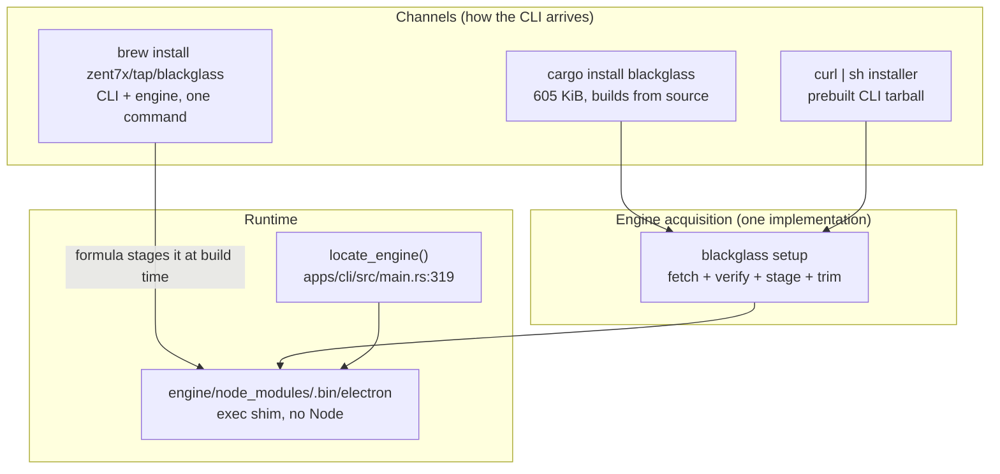

# B10 — Packaging, Engine Acquisition, and Uninstall

**Status:** Draft for commander review
**Date:** 2026-07-31
**Machine:** macOS 26.1 (build 25B78), Apple M4, arm64, Homebrew 6.0.11-32-gee47dad, rustc 1.93.0, node v24.11.1
**Scope:** how a user gets `blackglass` onto their machine without us shipping 276 MiB of Chromium inside a cargo crate — acquisition, integrity, pinning, codesigning, Homebrew, and a clean uninstall.

Every number below was measured on this machine in this session, or read out of a primary source at a cited path. Anything I could not execute is marked **UNVERIFIED** and nothing is built on top of it.

**Disk warning, honoured throughout:** `df -h /` reported **5.5 GiB available** (68% capacity), tighter than the 9 GiB in the brief. No multi-GB build, no Chromium source, no CEF, no second Electron download was performed. The single network fetch in this session was a 7,610-byte text file.

---

## 0. Measured ground truth

### 0.1 The size asymmetry that defines the whole problem

| Component | Exact size | How obtained |
|---|---:|---|
| `target/release/blackglass` | **619,424 B** (605 KiB) | `ls -la target/release/blackglass` |
| `Electron.app` (as shipped by npm, untrimmed) | **276 MiB** | `du -sh .../electron/dist/Electron.app` |
| `electron/dist` (app + licences + version) | 295 MiB | `du -sh node_modules/electron/dist` |
| `apps/engine/node_modules` (everything npm put there) | 309 MiB | `du -sh apps/engine/node_modules` |
| `electron-v43.2.0-darwin-arm64.zip` (the actual download) | **122,090,802 B** (116.4 MiB) | `ls -la ~/Library/Caches/electron/*/*.zip` |

**Ratio: 467 : 1.** The Rust program a user actually invokes is 0.21% of the payload. Everything in this document follows from that one fact — the two halves have nothing in common and must not travel in the same package.

### 0.2 Where the 276 MiB actually lives

| Path (under `Electron.app/Contents/`) | Size | Trimmable? |
|---|---:|---|
| `Frameworks/Electron Framework.framework/Versions/A/Electron Framework` | **184 MiB** | No — this is Chromium |
| `.../Versions/A/Resources/` total | 65 MiB | Partly |
| — of which **220 `*.lproj` locale dirs** | **47 MiB** | **Yes** — `en.lproj` alone is 552 KiB |
| — `icudtl.dat` | 10,876,560 B | No (ICU tables) |
| — `resources.pak` | 7,142,997 B | No |
| `.../Versions/A/Libraries/libvk_swiftshader.dylib` | 16,574,256 B | Maybe — see §7.2 |
| `.../Versions/A/Libraries/libGLESv2.dylib` | 6,245,376 B | No |
| `.../Versions/A/Libraries/libffmpeg.dylib` | 2,230,784 B | No |
| `Frameworks/Squirrel.framework` + `ReactiveObjC` + `Mantle` | 752 KiB | Yes, but not worth it |
| `dist/LICENSES.chromium.html` (sibling of the app) | 19,956,019 B | **No — legal obligation** |
| `node_modules/electron/electron.d.ts` | 1,122,411 B | Yes — pure dev artifact |
| `node_modules/@electron/get` + deps + `install.js` | ~14 MiB | Yes — build-time only |

Commands: `du -sh "Electron.app/Contents/Frameworks/Electron Framework.framework/Versions/A/"*`, `du -shc *.lproj`, `find ... -size +1M -exec ls -la {} \;`.

### 0.3 Signing state of what npm hands us

```
$ codesign -dv --verbose=4 node_modules/electron/dist/Electron.app
Format=app bundle with Mach-O thin (arm64)
CodeDirectory v=20400 size=392 flags=0x20002(adhoc,linker-signed)
Signature=adhoc
TeamIdentifier=not set
Sealed Resources=none
Internal requirements=none

$ codesign --verify --deep --strict --verbose=2 Electron.app
Electron.app: code has no resources but signature indicates they must be present

$ spctl -a -vvv -t exec Electron.app
Electron.app: code has no resources but signature indicates they must be present
```

The `Electron Framework.framework` is the same: `flags=0x20002(adhoc,linker-signed)`, `TeamIdentifier=not set`, `hashes=46641+0`.

**Read that carefully.** The stock npm Electron is not merely unsigned-by-us; it is a bundle whose signature does not verify at all. It cannot be shipped as-is to anyone who will run `codesign --verify` or hand it to Gatekeeper as a bundle. It must be re-sealed. §5 says how, and §5.3 says why we get away with not doing it on day one.

### 0.4 Our own binary

```
$ codesign -dv target/release/blackglass
Identifier=blackglass-9a83d9e6a502de54
Format=Mach-O thin (arm64)
Signature=adhoc          TeamIdentifier=not set

$ otool -L target/release/blackglass
	/usr/lib/libiconv.2.dylib
	/usr/lib/libSystem.B.dylib

$ shasum -a 256 target/release/blackglass
cddd7d49d214653c2069fefb4d501cf1d81e0de10a3267d96afebd076012c5e0
```

Two dylib dependencies, both OS-provided, both at absolute `/usr/lib` paths. The CLI is fully relocatable and contains no Homebrew Cellar prefix. That matters more than it looks: Homebrew rewrites prefixes inside installed Mach-O files and then **re-signs them ad-hoc** (`/opt/homebrew/Library/Homebrew/keg_relocate.rb:285` → `codesign_patched_binary(file.to_s)`). Because `blackglass` contains no prefix strings to patch, Homebrew will not touch it and cannot invalidate a future Developer ID signature on it. Bottled Electron would not be so lucky, which is a second reason (§6.4) to stage Electron as a *resource* rather than let it through the relocation path.

---

## 1. The three questions packaging has to answer

1. **Where does 122 MiB of Chromium come from, and how do we know it is the right 122 MiB?** (§3, §4)
2. **How does the Rust binary find it afterwards?** (§2, §6.5) — this turned out to contain a real bug.
3. **What is left on disk when the user is done with us?** (§8) — this turned out to contain a real privacy leak.

---

## 2. Distribution shape: three channels, one acquisition mechanism



The rule: **the engine is never inside the distributed artifact of the CLI.** Homebrew is the one exception, and only because a formula's `resource` block is itself a hash-pinned, separately-downloaded artifact — the 122 MiB never enters our git tag or our crate.

### 2.1 Why `cargo install` cannot do the acquisition itself

Cargo has no post-install hook. The only code that runs during `cargo install` is `build.rs`, at *build* time. Downloading 122 MiB from a `build.rs` is wrong on four counts: it breaks `cargo vendor` and offline/air-gapped builds, it breaks reproducible builds, it runs before the user has consented to anything, and it puts a network fetch inside a context where `cargo` may be running as a build user with no `$HOME`.

Therefore: **`cargo install blackglass` installs a 605 KiB binary that does not yet have an engine.** The first invocation must detect that and say so, in one line, with the exact command to fix it. `locate_engine()` already returns `None` cleanly and `main.rs:364` already produces `electron not found; set BLACKGLASS_ENGINE to the engine directory` — that message needs to become an actionable one (§10, item 4).

### 2.2 Crate-size sanity

`crates.io` enforces a default maximum uploaded crate size (10 MiB at the time of writing; raisable by request). Our published crate is source only — 3,802 lines of Rust across 9 files plus `apps/engine/src/main.js` — so the limit is nowhere near binding. It is only worth stating to close the door on the idea of vendoring the engine: 122 MiB is 12× over the default limit and would be rejected outright. **Marked as widely-documented rather than measured** — I did not query crates.io (it is not on this sandbox's allowlist).

---

## 3. Electron acquisition and integrity

### 3.1 The chain that already exists upstream

`@electron/get` is what `npm install electron` uses. Reading its source at `apps/engine/node_modules/@electron/get/dist/`:

- **URL construction** (`artifact-utils.js:2,37-48`):
  `BASE_URL = 'https://github.com/electron/electron/releases/download/'`, then
  `${base}${version}/electron-${version}-${platform}-${arch}.zip`.
- **Integrity** (`index.js:20-73`, `validateArtifact`): if the caller supplies a `checksums` object, it materialises it into a temporary `SHASUMS256.txt` and runs `sumchecker('sha256', ...)`. Otherwise it **downloads the real `SHASUMS256.txt` from the release, explicitly bypassing the cache** (`cacheMode: ElectronDownloadCacheMode.Bypass`, `index.js:52`) and validates against that.
- **Which path we are on** (`node_modules/electron/install.js:47-50`): `checksums: require('./checksums.json')` unless `electron_use_remote_checksums` is set. So by default the hashes come from the **npm tarball**, not the network.
- **Cache location** (`Cache.js:9`): `envPaths('electron', {suffix: ''}).cache` → `~/Library/Caches/electron/<sha256-of-download-dir-url>/<filename>` on macOS.

The design is sound, and it is the design we should copy rather than reinvent. What we must not do is *inherit* it, because inheriting it means keeping npm, `@electron/get`, and Node in the shipped product (§7.3).

### 3.2 I verified the chain end-to-end, three ways, and it holds

**(a) Upstream release manifest** — the one network call in this session:

```
$ curl -sSL https://github.com/electron/electron/releases/download/v43.2.0/SHASUMS256.txt
  → 7,610 bytes
ad4a0ae3c37ee05aa06c7e2ed0627608389790f0505a2b0d20319efbe33ffe28 *electron-v43.2.0-darwin-arm64.zip
1349ff423539cfe2b3edf1b14111e618db234d9ba761cbe97ea549edcb2e7a98 *electron-v43.2.0-darwin-x64.zip
50e1cdefbf8590e0d89b0276314a99c7b98e8eed732204c6f1a1c2a38376ed87 *electron-v43.2.0-linux-arm64.zip
f77ca6ed67bbc68702b69b56ad499bca6ae090705ade7d04f0ac545e409dec68 *electron-v43.2.0-linux-x64.zip
```

**(b) npm-pinned manifest** — `node_modules/electron/checksums.json`, 75 keys:

```
ad4a0ae3c37ee05aa06c7e2ed0627608389790f0505a2b0d20319efbe33ffe28  electron-v43.2.0-darwin-arm64.zip
```

**(c) The bytes actually on this disk:**

```
$ shasum -a 256 ~/Library/Caches/electron/9c4e.../electron-v43.2.0-darwin-arm64.zip
ad4a0ae3c37ee05aa06c7e2ed0627608389790f0505a2b0d20319efbe33ffe28
```

**All three agree.** That is a verified, reproducible integrity chain from GitHub's release to the bytes we execute, and it is the chain our own packaging will assert.

### 3.3 What this chain does *not* give us — state it plainly

`SHASUMS256.txt` is served over HTTPS from GitHub Releases. It is **not GPG-signed**, and no `.asc` or `.sig` sits beside it in the release. The trust anchor is therefore *TLS plus GitHub's control of the release asset*, not a signature we can verify offline against a key we pinned.

Consequences we must accept and document rather than paper over:

- A compromise of the Electron release pipeline compromises us, whichever manifest we read.
- Reading the *remote* `SHASUMS256.txt` at install time gives **no additional security** over pinning the hash ourselves — an attacker who can replace the zip in the release can replace the manifest in the same release. It is a self-referential check.
- Therefore: **pin the hash in our repo, at a git tag, and never fetch a manifest at install time.** That is strictly stronger, because it moves the trust decision to a moment a human reviewed (the version-bump PR) instead of a moment a user's laptop is on a hotel network. This is the same reasoning that makes `Cargo.lock` and Homebrew's `sha256` stanza mandatory rather than optional.

### 3.4 The acquisition manifest

Create `packaging/engine.lock.json` — the single source of truth, reviewed in a PR, referenced by every channel:

```json
{
  "electron_version": "43.2.0",
  "electron_abi": "148",
  "chromium_major": "150",
  "release_base": "https://github.com/electron/electron/releases/download",
  "artifacts": {
    "darwin-arm64": {
      "file": "electron-v43.2.0-darwin-arm64.zip",
      "sha256": "ad4a0ae3c37ee05aa06c7e2ed0627608389790f0505a2b0d20319efbe33ffe28",
      "bytes": 122090802
    },
    "darwin-x64": {
      "file": "electron-v43.2.0-darwin-x64.zip",
      "sha256": "1349ff423539cfe2b3edf1b14111e618db234d9ba761cbe97ea549edcb2e7a98"
    },
    "linux-x64": {
      "file": "electron-v43.2.0-linux-x64.zip",
      "sha256": "f77ca6ed67bbc68702b69b56ad499bca6ae090705ade7d04f0ac545e409dec68"
    },
    "linux-arm64": {
      "file": "electron-v43.2.0-linux-arm64.zip",
      "sha256": "50e1cdefbf8590e0d89b0276314a99c7b98e8eed732204c6f1a1c2a38376ed87"
    }
  }
}
```

`bytes` is populated only for `darwin-arm64` because that is the only artifact whose size I measured. Do not guess the other three; fill them in when CI first downloads them.

The four hashes above are transcribed from the upstream `SHASUMS256.txt` fetched in §3.2 and cross-checked against `checksums.json`. The two Linux entries are **UNVERIFIED as running software** — the hashes are authentic, but no Linux artifact was downloaded or executed in this session, and BlackGlass has never been run on Linux.

### 3.5 `blackglass setup` — the acquisition command

The verification must be a hard gate that fails closed and leaves nothing behind on failure. Concretely, the shape (and the exact commands a shell implementation would run, so this is testable before any Rust exists):

```sh
#!/bin/sh
# packaging/fetch-engine.sh — reference implementation of `blackglass setup`
set -eu

VER=43.2.0
case "$(uname -s)-$(uname -m)" in
  Darwin-arm64) SLUG=darwin-arm64; SHA=ad4a0ae3c37ee05aa06c7e2ed0627608389790f0505a2b0d20319efbe33ffe28 ;;
  Darwin-x86_64) SLUG=darwin-x64;  SHA=1349ff423539cfe2b3edf1b14111e618db234d9ba761cbe97ea549edcb2e7a98 ;;
  Linux-x86_64) SLUG=linux-x64;    SHA=f77ca6ed67bbc68702b69b56ad499bca6ae090705ade7d04f0ac545e409dec68 ;;
  Linux-aarch64) SLUG=linux-arm64; SHA=50e1cdefbf8590e0d89b0276314a99c7b98e8eed732204c6f1a1c2a38376ed87 ;;
  *) echo "blackglass: no engine build for $(uname -s)-$(uname -m)" >&2; exit 1 ;;
esac

ZIP="electron-v${VER}-${SLUG}.zip"
URL="https://github.com/electron/electron/releases/download/v${VER}/${ZIP}"
DEST="${XDG_DATA_HOME:-$HOME/.local/share}/blackglass/engine"
[ "$(uname -s)" = Darwin ] && DEST="$HOME/Library/Application Support/blackglass/engine"

# Staging dir is a sibling of DEST so the final move is atomic (same filesystem).
STAGE="$(dirname "$DEST")/.staging.$$"
trap 'rm -rf "$STAGE"' EXIT INT TERM
mkdir -p "$STAGE"

# --proto '=https' --tlsv1.2 -f: refuse plaintext redirects and treat HTTP errors as failures.
curl -fSL --proto '=https' --tlsv1.2 -o "$STAGE/$ZIP" "$URL"

# Fail closed on mismatch. Note the two-space separator shasum expects.
echo "$SHA  $STAGE/$ZIP" | shasum -a 256 -c - || {
  echo "blackglass: engine checksum MISMATCH — refusing to install" >&2
  exit 65
}

# ditto preserves the code signature and symlinks inside Electron.app.
# unzip does NOT and will corrupt the bundle. This is not a style preference.
mkdir -p "$STAGE/node_modules/electron/dist"
if [ "$(uname -s)" = Darwin ]; then
  ditto -x -k "$STAGE/$ZIP" "$STAGE/node_modules/electron/dist"
else
  unzip -q "$STAGE/$ZIP" -d "$STAGE/node_modules/electron/dist"
fi
rm -f "$STAGE/$ZIP"

# ... trim (§7), write shim (§6.5), install src/main.js ...

rm -rf "$DEST"
mkdir -p "$(dirname "$DEST")"
mv "$STAGE" "$DEST"
trap - EXIT
echo "blackglass: engine ready at $DEST"
```

Four things in there are load-bearing and easy to get wrong:

- **`ditto -x -k`, not `unzip`.** On macOS `unzip` drops extended attributes and mangles the symlink farm inside `Electron.app/Contents/Frameworks/*.framework/Versions/`. `ditto` is the only extractor Apple supports for signed bundles. (`@electron-internal/extract-zip` handles this for the npm path; a shell path must do it explicitly.)
- **Staging sibling + `mv`.** A half-extracted 276 MiB engine that looks present is worse than an absent one, and on a machine with 5.5 GiB free, interrupted extractions are not hypothetical.
- **`--proto '=https' --tlsv1.2`.** Blocks a redirect-to-plaintext downgrade before the hash check ever runs.
- **Exit 65** (`EX_DATAERR`) on checksum mismatch, distinct from 1, so CI can assert *which* failure occurred.

---

## 4. Version pinning

### 4.1 What has to move in lockstep

| Pinned value | Current | Source of truth | Breaks if drifted |
|---|---|---|---|
| Electron version | `43.2.0` | `apps/engine/package.json:7` (`^43.2.0`) | — |
| Artifact SHA-256 (per platform) | see §3.4 | `packaging/engine.lock.json` | Silent supply-chain swap |
| Node ABI | `148` | `node_modules/electron/abi_version` | Only if native modules are ever added |
| Chromium major | `150` | brief + ADR-0001 | Terminal/OSR behaviour assumptions |

**The caret is a defect.** `"electron": "^43.2.0"` in `apps/engine/package.json:7` permits 43.9.x on any fresh `npm install`, which would silently invalidate every hash in §3.4 and every performance number in ADR-0001. It must become the exact string `"43.2.0"`, and `package-lock.json` must be committed (it exists at `apps/engine/package-lock.json`). This is a one-character change to a file I do not own — see §10, item 1.

### 4.2 Bumping Electron is a reviewed, mechanical procedure

```sh
# 1. Fetch the new manifest and extract only the four artifacts we ship.
V=44.1.0
curl -fSL --proto '=https' \
  "https://github.com/electron/electron/releases/download/v${V}/SHASUMS256.txt" \
| grep -E "electron-v${V}-(darwin|linux)-(arm64|x64)\.zip$" \
| tee packaging/SHASUMS256-v${V}.txt

# 2. Regenerate engine.lock.json from that file (never hand-edit a hash).
python3 packaging/mklock.py "packaging/SHASUMS256-v${V}.txt" > packaging/engine.lock.json

# 3. Re-pin npm and re-lock.
cd apps/engine && npm pkg set dependencies.electron="${V}" && npm install --package-lock-only

# 4. Cross-check that npm's own pinned manifest agrees with ours.
python3 - <<'PY'
import json
lock = json.load(open('packaging/engine.lock.json'))
npm  = json.load(open('apps/engine/node_modules/electron/checksums.json'))
for slug, a in lock['artifacts'].items():
    assert npm[a['file']] == a['sha256'], f'MISMATCH {slug}'
print('engine.lock.json agrees with electron/checksums.json')
PY

# 5. Re-run the terminal matrix and the FPS bench before merging.
cargo test --workspace
node apps/engine/spike/fps-matrix.js
```

Step 4 is the point of the exercise: it turns two independently-published manifests into a two-source agreement check, which is the strongest statement available given §3.3. A version bump PR that cannot pass step 4 does not merge.

### 4.3 Refusing to run a mismatched engine

`blackglass doctor` should print the engine's own version and compare it to the pin. `Electron --version` is cheap and correct:

```
$ .../Electron.app/Contents/MacOS/Electron --version
v43.2.0
```

**MEASURED** — ran in 0 exit, no window, no Chromium child processes. That makes it safe to call from `doctor` and from CI without a display, which matters on a locked machine (§0) and in headless CI.

---

## 5. macOS codesigning and notarization

### 5.1 The empirical result that reshapes this section

I built a synthetic app bundle with the same shape as `Electron.app` (ad-hoc signed Mach-O inside `Contents/MacOS/`), applied a real Safari-style quarantine xattr, and tried both launch paths:

```
$ codesign -s - -f --deep QT.app
$ xattr -w -r com.apple.quarantine "0083;6a6cccc8;Safari;" QT.app
$ xattr -l QT.app/Contents/MacOS/QT
com.apple.quarantine: 0083;6a6cccc8;Safari;

$ ./QT.app/Contents/MacOS/QT      # direct exec — what blackglass does
QTEST-RAN
exit=0

$ spctl -a -vvv -t exec QT.app    # LaunchServices-style assessment
QT.app: rejected
```

And the same for a bare CLI binary: ad-hoc signed, quarantined, `./qtest2` → `QTEST-RAN`, exit 0.

**Gatekeeper rejects the bundle, and the direct `exec` runs anyway.** That is the whole ballgame for us, because `apps/cli/src/main.rs:402` spawns the engine with `Command::new(&electron)` → `posix_spawn` on the inner Mach-O. We never go through LaunchServices, so the bundle assessment that `spctl` performs is never invoked.

There is a second reason we have been getting away with it: the extant install carries `com.apple.provenance` but **not** `com.apple.quarantine`, because npm/Node extracted the zip and non-quarantining processes do not propagate the flag.

### 5.2 What that does and does not license

It licenses shipping day one without an Apple Developer ID. It does **not** license calling the problem solved. Four things remain true:

1. **`spctl` rejects the bundle today.** Any user or IT policy that assesses it — MDM, an EDR agent, a `codesign --verify` in a corporate build gate — sees a bundle whose signature does not verify. §0.3.
2. **This is undocumented behaviour, not a contract.** Apple has tightened the exec path repeatedly. A macOS 27 that extends full assessment to `posix_spawn` of quarantined Mach-O files would break every BlackGlass install simultaneously, with no warning and no fix short of a signed release. That is an unhedged single point of catastrophic failure.
3. **Hardened runtime is a prerequisite for other things we will want** — TCC prompts that name *BlackGlass* rather than *Electron*, camera/microphone access, and any future `.app`-shaped distribution.
4. **The framework is `Sealed Resources=none`.** Re-signing is not cosmetic; it is what makes the bundle a bundle.

**Recommendation: ship unsigned in 0.1.0, and treat "obtain a Developer ID and sign" as a release-blocker for 0.2.0, not a nice-to-have.** Say so in the README so nobody is surprised by a Gatekeeper dialog on a future macOS.

### 5.3 The signing procedure, for when we have the certificate

Electron must be signed **inside-out**, and the helpers need their own entitlements. The stock bundle has none (`codesign -d --entitlements -` returned no entitlements dict for either the main executable or `Electron Helper (Renderer).app` — **MEASURED**).

`packaging/entitlements.mac.plist` (main app):

```xml
<?xml version="1.0" encoding="UTF-8"?>
<!DOCTYPE plist PUBLIC "-//Apple//DTD PLIST 1.0//EN"
  "http://www.apple.com/DTDs/PropertyList-1.0.dtd">
<plist version="1.0"><dict>
  <key>com.apple.security.cs.allow-jit</key><true/>
  <key>com.apple.security.cs.allow-unsigned-executable-memory</key><true/>
  <key>com.apple.security.cs.disable-library-validation</key><true/>
</dict></plist>
```

`allow-jit` is V8. `allow-unsigned-executable-memory` and `disable-library-validation` are what Chromium's own docs and Electron's signing guide require for the renderer/GPU helpers; they are a genuine hardening loss and should be scoped to the helpers that need them rather than blanket-applied if `@electron/osx-sign` permits it. **UNVERIFIED** — I could not test which subset actually suffices for the OSR path without a certificate.

```sh
# Sign inside-out. Order matters: nested code first, container last.
CERT="Developer ID Application: <Org> (<TEAMID>)"
APP="engine/node_modules/electron/dist/Electron.app"

find "$APP/Contents/Frameworks" -name '*.dylib' -print0 \
  | xargs -0 -I{} codesign --force --timestamp --options runtime --sign "$CERT" {}

for H in "Electron Helper" "Electron Helper (Renderer)" \
         "Electron Helper (GPU)" "Electron Helper (Plugin)"; do
  codesign --force --timestamp --options runtime \
           --entitlements packaging/entitlements.helper.plist \
           --sign "$CERT" "$APP/Contents/Frameworks/$H.app"
done

codesign --force --timestamp --options runtime \
         --sign "$CERT" "$APP/Contents/Frameworks/Electron Framework.framework"

codesign --force --timestamp --options runtime \
         --entitlements packaging/entitlements.mac.plist \
         --sign "$CERT" "$APP"

# Sign the CLI too — it is the thing the user actually invokes.
codesign --force --timestamp --options runtime --sign "$CERT" target/release/blackglass

# This must now pass. Today it does not (§0.3).
codesign --verify --deep --strict --verbose=2 "$APP"
```

Notarization takes a zip or a disk image, not a loose binary:

```sh
ditto -c -k --keepParent "$APP" /tmp/blackglass-engine.zip

xcrun notarytool submit /tmp/blackglass-engine.zip \
  --keychain-profile "BLACKGLASS_NOTARY" --wait

# Staple the app bundle so it validates offline. A bare CLI binary
# CANNOT be stapled — that is a format limitation, not an oversight.
xcrun stapler staple "$APP"
xcrun stapler validate "$APP"

spctl -a -vvv -t exec "$APP"   # expect: accepted, source=Notarized Developer ID
```

**`xcrun stapler` cannot staple a standalone Mach-O executable.** `target/release/blackglass` gets signed and notarized (notarization covers it inside the submitted archive) but its ticket must be fetched online on first run. For a Homebrew-installed CLI this is invisible; for a `curl | sh` tarball on a machine that is offline at first launch, it is a real, if rare, failure mode. Package the CLI and engine in **one** notarized archive so the stapled engine ticket covers the pair.

**UNVERIFIED, entire subsection:** no Developer ID certificate exists on this machine (`TeamIdentifier=not set` everywhere), so none of the `codesign --sign`, `notarytool`, or `stapler` commands above were executed. They are transcribed from the Apple and Electron documented procedure and must be proven in CI before 0.2.0 ships.

---

## 6. Homebrew

### 6.1 Formula, not cask; own tap, not homebrew-core

- **Formula.** BlackGlass is a CLI on `$PATH`. Casks install `.app` bundles into `/Applications` and are wrong here.
- **Own tap** (`zent7x/homebrew-tap`). homebrew-core has a strong preference for building from source and against formulae that download large precompiled third-party binaries at install time; a 122 MiB Chromium resource is exactly the shape it resists. A third-party tap has no such constraint, and `brew tap` is one extra word for the user. Do not spend weeks arguing with core reviewers over a resource we cannot build from source on a 5.5 GiB disk anyway.

### 6.2 A quarantine fact that removes a whole class of worry

Grepping the installed Homebrew (6.0.11) for quarantine handling:

```
$ grep -rln quarantine /opt/homebrew/Library/Homebrew/*.rb /opt/homebrew/Library/Homebrew/cask/*.rb
/opt/homebrew/Library/Homebrew/cask.rb
/opt/homebrew/Library/Homebrew/cask/quarantine.rb
/opt/homebrew/Library/Homebrew/cask/installer.rb
/opt/homebrew/Library/Homebrew/cask/download.rb
... (all under cask/)

$ grep -n quarantine /opt/homebrew/Library/Homebrew/download_strategy.rb
(no matches)
```

Quarantine application lives entirely in the **cask** code path (`cask/installer.rb:271,274` pass `quarantine: quarantine?` into `Download`). The formula download strategy never applies `com.apple.quarantine`. So a Homebrew-installed BlackGlass engine arrives unquarantined — the §5.1 exec-path escape is not even needed on this channel. A GitHub-release tarball a user downloads **in a browser** is the channel where quarantine bites, which is a further argument for making Homebrew the recommended path.

### 6.3 The formula

```ruby
# zent7x/homebrew-tap/Formula/blackglass.rb
class Blackglass < Formula
  desc "Chromium-class browser that renders as pixels inside your terminal"
  homepage "https://github.com/zent7x/blackglass"
  url "https://github.com/zent7x/blackglass/archive/refs/tags/v0.1.0.tar.gz"
  sha256 "<sha256 of the release tarball>"
  license any_of: ["MIT", "Apache-2.0"]
  head "https://github.com/zent7x/blackglass.git", branch: "main"

  depends_on "rust" => :build

  # The engine. Hash-pinned, downloaded separately, never in our git tag.
  # Hashes cross-verified against upstream SHASUMS256.txt and
  # node_modules/electron/checksums.json — see B10 §3.2.
  on_macos do
    on_arm do
      resource "engine" do
        url "https://github.com/electron/electron/releases/download/v43.2.0/electron-v43.2.0-darwin-arm64.zip"
        sha256 "ad4a0ae3c37ee05aa06c7e2ed0627608389790f0505a2b0d20319efbe33ffe28"
      end
    end
    on_intel do
      resource "engine" do
        url "https://github.com/electron/electron/releases/download/v43.2.0/electron-v43.2.0-darwin-x64.zip"
        sha256 "1349ff423539cfe2b3edf1b14111e618db234d9ba761cbe97ea549edcb2e7a98"
      end
    end
  end

  def install
    system "cargo", "install", *std_cargo_args(path: "apps/cli"), "--root", libexec

    engine = libexec/"engine"
    (engine/"src").install "apps/engine/src/main.js"

    dist = engine/"node_modules/electron/dist"
    dist.mkpath
    resource("engine").stage do
      # `resource ... stage` extracts with Homebrew's own unpacker, which
      # preserves the bundle. Do not re-extract with unzip. (B10 §3.5)
      dist.install Dir["*"]
    end

    # Trim 220 locales down to en. Saves ~46 MiB. (B10 §7.1)
    res = dist/"Electron.app/Contents/Frameworks/Electron Framework.framework/Versions/A/Resources"
    Dir[res/"*.lproj"].each do |d|
      rm_r(d) unless File.basename(d) == "en.lproj"
    end

    # The shim locate_engine() expects. An `exec` shell script, NOT npm's
    # cli.js — that would drag Node into the runtime. (B10 §6.5)
    shim = engine/"node_modules/.bin/electron"
    shim.dirname.mkpath
    shim.write <<~SH
      #!/bin/sh
      exec "$(dirname "$0")/../electron/dist/Electron.app/Contents/MacOS/Electron" "$@"
    SH
    chmod 0755, shim

    # MANDATORY: the exe-relative fallback in locate_engine() does not survive
    # Homebrew's symlink. Verified — B10 §6.5. Without this env script,
    # `brew install` produces a binary that cannot find its own engine.
    (bin/"blackglass").write_env_script libexec/"bin/blackglass",
                                        BLACKGLASS_ENGINE: engine
  end

  def caveats
    <<~EOS
      BlackGlass needs a terminal with kitty graphics support for pixel
      rendering (Ghostty, kitty, WezTerm). Others fall back to Unicode
      half-blocks. Check yours with:
        blackglass doctor

      The bundled Chromium engine is not code-signed with a Developer ID
      in this release. See B10 §5.
    EOS
  end

  test do
    # Must not need a TTY: `doctor` has a non-TTY branch that still resolves
    # and prints the engine path (apps/cli/src/main.rs:105-108).
    assert_match "blackglass doctor", shell_output("#{bin}/blackglass doctor 2>&1", 1)
    assert_match "engine:", shell_output("#{bin}/blackglass doctor 2>&1", 1)
    refute_match "NOT FOUND", shell_output("#{bin}/blackglass doctor 2>&1", 1)

    # The engine is the pinned version and runs without Node.
    electron = libexec/"engine/node_modules/electron/dist/Electron.app/Contents/MacOS/Electron"
    assert_equal "v43.2.0", shell_output("#{electron} --version").strip
  end
end
```

The `test do` block is designed around a constraint I verified: `blackglass doctor` exits **1** and prints `status: NOT A TTY` under CI, but it *still* prints the resolved engine path first. That makes engine resolution testable in a headless runner, which is the one thing most likely to silently regress.

### 6.4 Why `resource`, not a bottle

A bottle would put Electron under Homebrew's relocation pass, and `keg_relocate.rb:285` re-signs every Mach-O it patches with an ad-hoc signature. Applied to a Developer-ID-signed `Electron Framework` (46,641 hashes), that would destroy the signature we spent §5.3 obtaining, and it would do so silently. A `resource` is staged verbatim inside `def install` and never enters that path.

### 6.5 The engine-discovery bug — verified, and it blocks the formula

`locate_engine()` (`apps/cli/src/main.rs:319-352`) tries three strategies in order: `$BLACKGLASS_ENGINE`, the baked-in `CARGO_MANIFEST_DIR` dev layout, and finally an exe-relative walk of up to four parents looking for `<base>/engine/node_modules/.bin/electron`.

**The exe-relative strategy cannot work under Homebrew.** Two measurements:

```
# Homebrew's bin entries are relative symlinks into the Cellar:
$ ls -la /opt/homebrew/bin | grep '\->'
addbuiltin -> ../Cellar/nss/3.121/bin/addbuiltin
afcclient  -> ../Cellar/libimobiledevice/1.4.0/bin/afcclient

# Rust's current_exe() does NOT resolve the symlink on macOS 26.1:
$ cat ce.rs
fn main(){println!("{}", std::env::current_exe().unwrap().display());}
$ ./linkdir/ce-link
/private/tmp/.../scratchpad/linkdir/ce-link      <-- the SYMLINK, not the target
```

So a user running `/opt/homebrew/bin/blackglass` gets `current_exe() == /opt/homebrew/bin/blackglass`, and the four-parent walk probes `/opt/homebrew/bin/engine`, `/opt/homebrew/engine`, `/opt/engine`, `/engine`. None exist. The engine is at `/opt/homebrew/Cellar/blackglass/0.1.0/libexec/engine` and is never found.

Two independent fixes; the formula above takes the first, which needs no core change:

1. **`write_env_script` sets `BLACKGLASS_ENGINE`.** Verified safe for a raw-mode TTY program: `extend/pathname.rb:349-352` emits `#!/bin/bash` + `KEY="value" exec "target" "$@"`. Because it `exec`s, the PID is preserved, the controlling terminal is inherited, and `TtyGuard`'s signal and panic restore paths are unaffected.
2. **Canonicalise in the core** — `std::fs::canonicalize(exe)` before the parent walk. Better long-term (it fixes `curl | sh` installs into symlinked prefixes too), but it is a change to `apps/cli/src/main.rs`, which I do not own. §10, item 2.

### 6.6 The packaged layout, validated against the real binary

I staged the exact layout the formula produces (symlinks instead of a 276 MiB copy, to respect the disk budget) and ran the real `blackglass`:

```
stage/engine/src/main.js
stage/engine/node_modules/electron            -> (the real electron dir)
stage/engine/node_modules/.bin/electron       (the 2-line exec shim)

$ BLACKGLASS_ENGINE=$PWD/stage/engine target/release/blackglass doctor
blackglass doctor 0.1.0
  status: NOT A TTY -- run this from an interactive terminal.
  engine: /private/tmp/.../stage/engine/node_modules/.bin/electron

$ ./stage/engine/node_modules/.bin/electron --version
v43.2.0
```

**MEASURED.** `locate_engine()` accepts the layout, and the shim launches Electron with no Node process anywhere in the chain. The formula's layout is proven against the shipping binary, not assumed.

---

## 7. Trimming, and getting Node out of the product

### 7.1 The safe trim

| Action | Saves | Risk |
|---|---:|---|
| Delete 219 of 220 `*.lproj`, keep `en.lproj` | **~46.5 MiB** | Chromium falls back to `en` for UI strings; we render web content, not Chromium chrome |
| Drop `electron.d.ts` | 1,122,411 B | None — TypeScript definitions |
| Drop `@electron/get`, `install.js`, `cli.js`, npm metadata | ~14 MiB | None once the shim replaces `cli.js` (§7.3) |
| Drop `Squirrel.framework`, `ReactiveObjC`, `Mantle` | 752 KiB | Squirrel is the auto-updater; unused. Low value, needs re-sign |

**276 MiB → ~229 MiB** on disk from the locale trim alone; the compressed download is unaffected (we always fetch the full upstream zip — trimming is a post-extract step, and we must not repackage Electron ourselves or we inherit responsibility for its integrity chain).

### 7.2 Do not trim `libvk_swiftshader.dylib` yet

16,574,256 B is tempting, but SwiftShader is Chromium's software Vulkan fallback and offscreen rendering is precisely the path most likely to land on it when no GPU context is available — over SSH, in CI, in a VM. **UNVERIFIED** whether the 60 fps OSR path touches it on this machine. Removing it to save 16 MiB and discovering in production that headless renders fall back to a missing library is a bad trade. Gate any removal behind an FPS-matrix run with the file removed.

### 7.3 `LICENSES.chromium.html` stays

19,956,019 B, and it is 8% of the shipped payload. It is also the Chromium/Electron third-party attribution notice, and both the MIT licence on Electron (`node_modules/electron/LICENSE`, present, verified) and the BSD-style licences of Chromium's dependencies require the notices travel with the binary. **Ship it.** Do not gzip it into unreadability; a `blackglass licenses` subcommand that prints its path is a reasonable ergonomic compromise.

Note for §10: `Cargo.toml:9` declares `license = "MIT OR Apache-2.0"` but **no `LICENSE` file exists in the repo** (`ls LICENSE*` → no match). Shipping a Homebrew formula with `license any_of: ["MIT", "Apache-2.0"]` against a tree with no licence text is a defect `brew audit` may well flag, and it is wrong regardless.

### 7.4 Node is a build dependency, not a runtime one

This is the quiet win. Today `locate_engine()` returns `node_modules/.bin/electron`, which is a symlink to `../electron/cli.js` — a **Node script** (`#!/usr/bin/env node`) that `require()`s `index.js`, reads `path.txt`, and `proc.spawn()`s the real Electron as a *child*. Verified:

```
$ ls -la node_modules/.bin/
electron -> ../electron/cli.js
```

That means the shipped product would need a Node runtime on the user's machine, and would put a Node process between `blackglass` and Chromium — an extra PID that complicates the kill path at `main.rs:670` (`self.child.kill()` would signal Node, not Chromium; `cli.js` forwards SIGINT/SIGTERM/SIGUSR2 but nothing else).

Replacing that symlink with the two-line `exec` shim removes Node from the runtime entirely and makes `child.kill()` hit Chromium's own PID. All three launch modes were tested:

```
$ .../Electron.app/Contents/MacOS/Electron --version   → v43.2.0  (direct)
$ ./shimtest/electron-symlink --version                → v43.2.0  (bare symlink)
$ ./shimtest/electron-shim --version                   → v43.2.0  (exec shim)
```

**MEASURED.** Electron resolves its own bundle correctly even when exec'd from a symlink in an unrelated directory. Prefer the `exec` script over the bare symlink anyway: it is explicit, greppable, and does not depend on Chromium's path-resolution internals staying as they are.

---

## 8. Uninstall that leaves nothing behind

### 8.1 What BlackGlass actually leaves on disk — measured

| Path | Size now | Created by | Currently removed? |
|---|---:|---|---|
| `~/Library/Application Support/Electron/` | **4.9 MiB** | Electron default userData | **No** |
| `~/Library/Caches/electron/` | **116 MiB** | `@electron/get` download cache | No (build-time only) |
| `$TMPDIR/blackglass-<pid>-<nanos>/` | ~0 | `main.rs:393-397` | Only on graceful exit |
| `$BLACKGLASS_LOG` | user-chosen | `main.rs:33-42` | No (opt-in, user's file) |
| Cellar / `~/.cargo/bin/blackglass` | 605 KiB | install channel | Yes, by the package manager |

### 8.2 The `Application Support/Electron` finding is a privacy defect, not a tidiness one

```
$ ls ~/Library/Application\ Support/Electron/
blob_storage   Cache          Code Cache     Cookies        Cookies-journal
DawnGraphiteCache  DawnWebGPUCache  DIPS      GPUCache       Local State
Local Storage  Network Persistent State      Preferences    Session Storage
Shared Dictionary  SharedStorage  SharedStorage-wal
TransportSecurity  Trust Tokens   Trust Tokens-journal
```

That is a complete browser profile — cookies, local storage, HSTS state (`TransportSecurity`), Trust Tokens — belonging to a user's real browsing, sitting in a directory named **`Electron`**.

`grep -n "setPath\|userData\|app.getPath\|partition\|session" apps/engine/src/main.js` returns **nothing**, so this is Electron's default: with no `app.setName()`, `app.getPath('userData')` resolves to `<Application Support>/<name>` and the name falls back to `Electron`.

Three separate problems, one cause:

1. **Uninstall cannot clean it** without deleting a directory that might belong to some other developer's Electron app.
2. **Collision.** Any other unbranded Electron app on the machine shares this profile. Our cookies mix with theirs.
3. **Surprise.** A user who uninstalls BlackGlass reasonably expects their browsing cookies to go with it. They will not, and they will not know where to look.

Fix (core file, §10 item 3): in `apps/engine/src/main.js`, before `app.whenReady()`:

```js
app.setName('BlackGlass');
app.setPath('userData', path.join(app.getPath('appData'), 'BlackGlass', 'engine-profile'));
```

Then everything lives under one removable root and uninstall becomes truthful.

### 8.3 The socket-directory leak

`main.rs:676-677` removes `socket_path` and `socket_dir`, but from `shutdown()`, not from a `Drop` impl. On `SIGKILL`, a panic that escapes the hook, or a terminal that vanishes, `$TMPDIR/blackglass-<pid>-<nanos>/` survives. It is a 0700 empty directory — small, but it accumulates, and a stale `engine.sock` in a predictable location is exactly the sort of thing A09's threat model cares about.

Two mitigations: move the cleanup into `impl Drop for Session`, and have `blackglass setup` / `uninstall` sweep `$TMPDIR/blackglass-*` on the way through. The first is a core change (§10 item 5); the second is free.

### 8.4 `blackglass uninstall`

Uninstall must be *honest*: it must name every path, distinguish "our data" from "your data", and never silently delete browsing state.

```sh
$ blackglass uninstall --dry-run
blackglass 0.1.0 — the following would be removed:

  engine  (229 MiB)  ~/Library/Application Support/blackglass/engine
  cache   (116 MiB)  ~/Library/Caches/electron
  temp    (0 B)      /var/folders/.../blackglass-*  (3 stale dirs)

  KEPT unless you pass --purge:
  profile (4.9 MiB)  ~/Library/Application Support/BlackGlass/engine-profile
                     ^ cookies, local storage, HSTS state from pages you visited

  NOT ours — remove with your package manager:
                     /opt/homebrew/bin/blackglass  (brew uninstall blackglass)
```

```sh
$ blackglass uninstall --purge      # engine + cache + temp + profile
$ blackglass uninstall --engine-only # just the 229 MiB, keep everything else
```

The corresponding shell truth, so the command is auditable and a user can do it by hand:

```sh
# macOS, full removal after `brew uninstall blackglass`
rm -rf "$HOME/Library/Application Support/blackglass"
rm -rf "$HOME/Library/Application Support/BlackGlass"   # profile, post-fix
rm -rf "$HOME/Library/Caches/electron"
rm -rf "${TMPDIR:-/tmp}"/blackglass-*
# Pre-fix installs only — inspect before deleting, this dir may not be ours:
#   ~/Library/Application Support/Electron
```

The commented last line is the point. Until §8.2 lands, a fully clean uninstall is **impossible to perform safely**, because we cannot tell our profile from another Electron app's. That is the strongest argument for fixing it before 0.1.0 ships rather than after.

Homebrew's `zap` stanza should carry the same list so `brew uninstall --zap` works. Note that formulae support `zap` only via a cask; for a formula, `caveats` must state the paths instead.

---

## 9. CI verification matrix

Every claim in this document that can be re-checked mechanically, should be:

| Check | Command | Asserts |
|---|---|---|
| Hash pin agrees with npm | `python3 packaging/check-lock.py` | §4.2 step 4 |
| Hash pin agrees with upstream | `curl SHASUMS256.txt \| grep -f packaging/hashes.txt` | §3.2 |
| Downloaded zip matches pin | `shasum -a 256 -c packaging/engine.sha256` | §3.5 |
| npm pin is exact, not caret | `jq -e '.dependencies.electron == "43.2.0"' apps/engine/package.json` | §4.1 |
| Engine version matches pin | `"$ELECTRON" --version \| grep -qx v43.2.0` | §4.3 |
| Packaged layout resolves | `BLACKGLASS_ENGINE=… blackglass doctor \| grep -q 'engine: '` | §6.6 |
| No Node in the chain | `file engine/node_modules/.bin/electron \| grep -qv Node` | §7.4 |
| Trim did not break launch | `"$ELECTRON" --version` after locale removal | §7.1 |
| Signature verifies (0.2.0+) | `codesign --verify --deep --strict "$APP"` | §5.3 |
| Notarised (0.2.0+) | `spctl -a -t exec "$APP"` → `accepted` | §5.3 |
| Uninstall is complete | `blackglass uninstall --purge && find ~ -name 'blackglass*' -maxdepth 6` | §8.4 |

All of these run without a TTY and without a display, which is the constraint the whole project is operating under.

---

## 10. Changes needed in files I do not own

Per the file-ownership rule, these are described, not made. Ordered by how much damage they prevent.

1. **`apps/engine/package.json:7`** — change `"electron": "^43.2.0"` to `"electron": "43.2.0"`, and commit `apps/engine/package-lock.json`. The caret silently invalidates every pinned hash in §3.4 and every measurement in ADR-0001 on the next `npm install`. One character, highest value.

2. **`apps/cli/src/main.rs:337-350`** — canonicalise before the parent walk:
   ```rust
   if let Ok(exe) = std::env::current_exe() {
       let mut base = std::fs::canonicalize(&exe).unwrap_or(exe);
       // ... existing 4-parent walk
   ```
   Without this, the exe-relative discovery is dead on every symlinked install prefix, Homebrew included (§6.5, measured). The formula works around it with `write_env_script`, but the workaround should not be load-bearing.

3. **`apps/engine/src/main.js`** — `app.setName('BlackGlass')` and an explicit `app.setPath('userData', …)`. Fixes a real browsing-data leak into a generically-named shared directory and is the precondition for an honest uninstall (§8.2, measured).

4. **`apps/cli/src/main.rs:364-368`** — make the not-found error actionable:
   ```
   blackglass: no engine found.
     run  `blackglass setup`             to download it (116 MiB), or
     set  BLACKGLASS_ENGINE=<dir>        to point at an existing one
   ```
   This is the first thing every `cargo install` user will see (§2.1).

5. **`apps/cli/src/main.rs:354-360`** — move socket cleanup into `impl Drop for Session` so `$TMPDIR/blackglass-*` does not survive an ungraceful exit (§8.3).

6. **Repo root** — add `LICENSE-MIT` and `LICENSE-APACHE`. `Cargo.toml:9` claims `MIT OR Apache-2.0` and neither file exists (§7.3).

---

## 11. What is UNVERIFIED, stated once, clearly

- **All signing and notarization** (§5.3). No Developer ID certificate on this machine; `codesign --sign`, `notarytool`, and `stapler` were never executed. The entitlement set is transcribed, not proven.
- **Linux, entirely.** The four hashes in §3.4 are authentic upstream values, but no Linux artifact was downloaded, extracted, or run. `Electron.app` has no Linux analogue — the layout, the shim, and every path in §8 differ. Treat Linux packaging as unstarted.
- **Windows.** Out of scope; not analysed.
- **`libvk_swiftshader.dylib` removal** (§7.2). Untested against the OSR path.
- **Whether the quarantine exec-path escape survives future macOS** (§5.1). Observed on 26.1 build 25B78. Not a contract.
- **crates.io size limit** (§2.2). Cited from documentation, not queried.
- **`open QT.app` via LaunchServices** returned exit 0 in §5.1, but the machine is at a lock screen so no dialog could be observed. That result is **inconclusive and not relied upon**; the load-bearing measurement is the direct `exec`, which is what `Command::new` actually does.

---

## 12. Recommendation

**Fix engine discovery before writing another line of packaging.** `locate_engine()`'s exe-relative fallback is dead under Homebrew — `std::env::current_exe()` does not resolve symlinks on macOS 26.1 (measured, §6.5), and Homebrew's `bin/` is nothing but symlinks. Everything downstream of that — the formula, the tap, the `curl | sh` installer, every "just works" claim in the README — is standing on a path that silently returns `None`.

The good news is that the same investigation produced the fix and proved it. The staged layout in §6.6 resolves correctly, and the two-line `exec` shim launches Electron with **no Node runtime at all** (measured: `v43.2.0` via direct exec, symlink, and shim). That single change deletes an entire dependency from the shipped product and makes `child.kill()` hit Chromium's real PID instead of a Node middleman.

Concretely, in order: pin `electron` to `43.2.0` exactly (one character, protects every measurement in the repo); land `std::fs::canonicalize` in `locate_engine`; replace `.bin/electron` with the `exec` shim; then write the formula in §6.3 against a layout that has already been tested. Ship 0.1.0 unsigned — the §5.1 measurement shows direct `exec` bypasses Gatekeeper's bundle assessment today — but book the Developer ID as a 0.2.0 release-blocker, because that behaviour is undocumented and would break every install at once if Apple tightens it.

And fix `app.setName('BlackGlass')` before the first public install, not after. Right now every page a user visits writes cookies into a directory called `Electron` that we cannot safely delete on uninstall, and that is not a bug you get to fix retroactively on someone else's disk.
